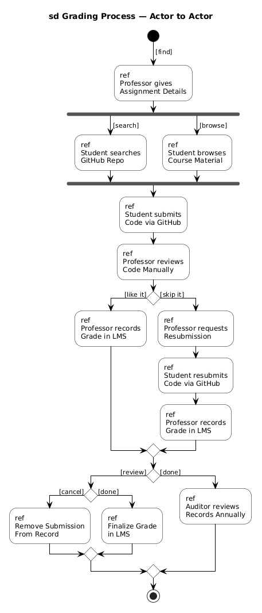
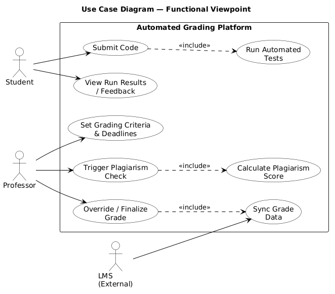
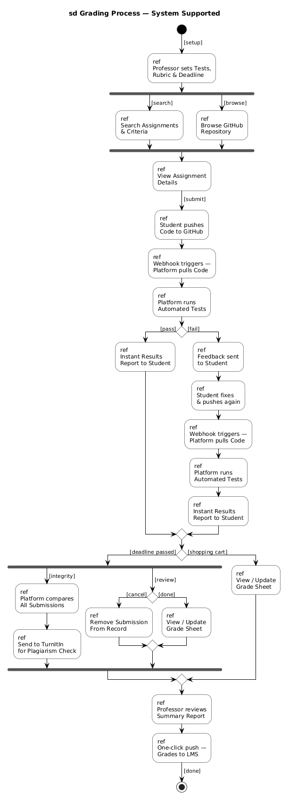

## 1) Interaction Overview Diagram — Actor to Actor (Context Viewpoint) ##

This diagram shows how people (student, professor, auditor) interact with each other.
There is no system yet, only people.

How it works:

* The student searches or browses to find the assignment
* Then the student writes code
* The student sends the code to the professor using GitHub
* The professor checks the code
 If it is good → accept
If not → send back for fixing
* When everything is correct → grade is added to LMS
* At the end of the year → auditor checks everything

## 2) Use Case Diagram — Functional Viewpoint ##

This diagram shows what the system can do and who uses it

How it works:

* Student and professor use the system directly

1) Student can:

   * Submit code
   * View results

2) Professor can:

   * Set deadlines
   * Check plagiarism
   * Finalize grades

Dashed arrows mean automatic actions
Example: when student submits → system runs tests automatically
LMS is on the right because it is an external system.
It only receives final grades

## 3) Interaction Overview Diagram — System Supported (Context Viewpoint)

This shows the full process with the system included

How it works:

1) Setup
   * Professor sets tests and deadline
2) Submission
   * Student uploads code to GitHub
   * System automatically detects it
3) Feedback
   * System runs tests
   * Sends result to student
   * If failed → student fixes and submits again
4) Plagiarism Check
   * After deadline → system sends all submissions to  TurnItIn automatically
5) Finalization
   * Professor checks report
   * Clicks once → all grades sent to LMS

## Reflection 
In this practical, I learned how UML diagrams show how a system works in real life. I understood how students and professors interact and how the system helps in the process. I also learned that some tasks are done automatically by the system. This practical helped me understand system design better.

## Clarity & Coherence
This report is written in a clear and simple way so that it is easy to understand. Each section is properly organized and the diagrams are explained in a logical order from basic interaction to full system process.

The ideas are connected smoothly and simple language is used to avoid confusion. This makes the report easy to read and helps the reader understand the workflow without difficulty.
## References

GeeksforGeeks. (n.d.). Interaction overview diagrams – Unified Modeling Language (UML). https://www.geeksforgeeks.org/interaction-overview-diagrams-unified-modeling-language-uml/

GeeksforGeeks. (n.d.). Use case diagram. https://www.geeksforgeeks.org/use-case-diagram/

Visual Paradigm. (n.d.). What is interaction overview diagram? https://www.visual-paradigm.com/guide/uml-unified-modeling-language/what-is-interaction-overview-diagram/

USED AI - https://claude.ai/chat/d6d819c8-ac71-4000-bef7-974b955e3f9a