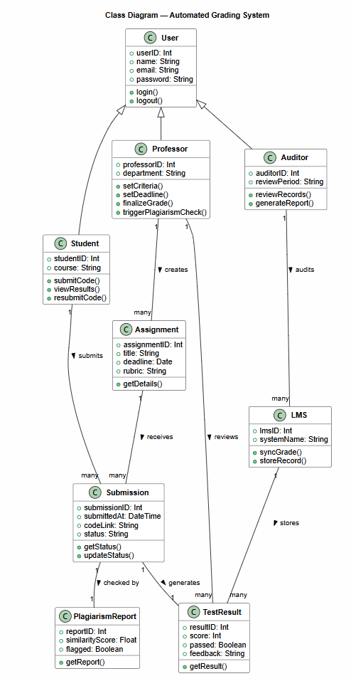
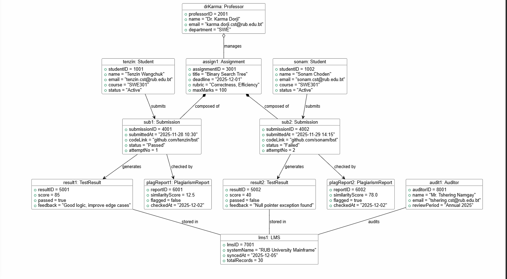

# UML Class Diagram

A class diagram shows how a system is organized. It helps us understand what things are inside the system, what information they store, and how they are connected to each other. You can think of it like a map of the system.

Each class is shown as a box with three parts. The top part shows the name of the class. The middle part shows the data it stores, which are called attributes. The bottom part shows what the class can do, which are called methods.

In this system, the User is the main or parent class. It stores basic information like name, email, and password. The Student, Professor, and Auditor classes come from the User class. This means they all share the basic information but also have their own special features.

The Student can submit code, view results, and resubmit if they fail. The Professor can create assignments, set rules and deadlines, give final grades, and check for plagiarism. The Auditor can review records and create reports.

There are also other important classes in the system. The Assignment class stores details about each task, such as the title, deadline, and rubric. The Submission class is created when a student submits their code, and it stores the code link and whether it passed or failed. The TestResult class is automatically created after a submission and stores the score, result, and feedback. The PlagiarismReport class is created after the deadline and shows similarity scores and any cheating flags. The LMS is an external system that stores all the final grades.

The relationships between the classes show how they are connected. A Professor can create many Assignments, and a Student can make many Submissions. Each Submission has one TestResult and one PlagiarismReport. At the end, the LMS stores all the final results.

In simple terms, a class diagram is a way to clearly see how a system works, what each part does, and how everything is connected together.

#

# UML Object Model

#### Student 1: Tenzin Wangchuk

- Submitted once on 28th November
- Got 85 marks (passed)
- Received feedback to improve edge cases
- Plagiarism score: 12.5% (acceptable)

#### Student 2: Sonam Choden

- Submitted twice
- Got 40 marks (failed)
- Had a null pointer error in code
- Plagiarism score: 78% (very high, flagged)

All this data is stored in the RUB University system, and Mr. Tshering Namgay (auditor) can review it at the end of 2025.

---

### Types of lines in the diagram

- **Filled diamond (Composition)**
  - Assignment _owns_ submissions
  - If assignment is deleted, submissions are also deleted

- **Hollow diamond (Aggregation)**
  - Professor manages assignment
  - Both can exist separately

- **Dashed arrow (Dependency)**
  - Submission depends on results like test and plagiarism

- **Plain line (Link)**
  - Simple connection between system parts (like LMS and auditor)

---

### Why it matters

This diagram shows that the system really works in real life.  
It uses real students, real marks, and real situations, not just theory.
